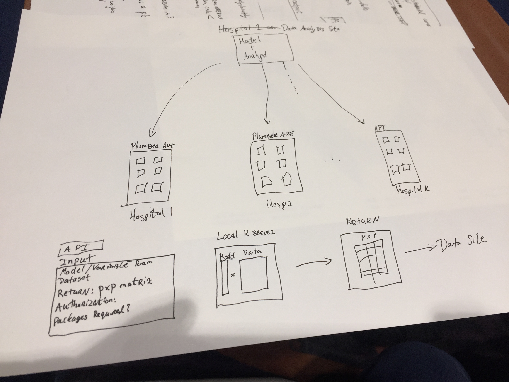

```{r setup, include = FALSE}
library(knitr)
knitr::opts_chunk$set(echo = FALSE, message = FALSE)
library(dplyr)
```


# Introduction
We introduce a distrbuted framework to analyze data from multiple sources with the data being properly siloed. The motivation for this problem is simple: we would like to fit a generalized linear model (GLM) on data from multiple sites (e.g. hospitals), where the indvidual patient-level data or otherwise private data never leaves the server (siloed), which is usually behind a firewall.  The idea is that a model is specified, and sent to each site where a summary statistic is computed and returned to the modeling service/site.  The model is then updated and, if necessary, the process is completed until the model is fit until convergence.  The goal is to fit the exact model as if the full data was accessible.  


The alternatives to this process is meta-analysis, one-step solutions, or remote analysis servers [@o2008remote;].  There are drawbacks to a meta-analysis approach in that the model and statistics must be specified and commonly the data is gathered **once** from each site.  Also, if sites present estimates from models with different predictors, it is unclear how meta-analysis adequately handles this variability.  The process below ensures that the same model, with the same predictors, is fit at each site.  Any updated analysis requires additional correspondence between the modeler and the site data analyst, which slows down the process of analysis and creates more hurdles.  

The work presented here is almost identical to Grid Binary LOgistic REgression (GLORE) [@glore], its Bayesian analog EXpectation Propagation LOgistic REgRession (EXPLORER) [@explorer], and  Secure Pooled Analysis acRoss K-sites (SPARK) [@spark].  A few of the differences are: GLORE and EXPLORER focus primarily on only logistic regression, SPARK works for all GLMs like the proposed method.  GLORE and SPARK are iterative requiring all sites to provide updates until the next estimate can be achieved, like the current method; EXPLORER is iterative but asynchronous so that sites can share updates without coordination.  SPARK additionally compute on encrypted data, which allows for higher security; EXPLORER uses random matrix implementations to increase security, but required inter-site communication.  Similarly, @wang2017efficient show an iterative method for regularized/sparse model fitting.  @jordan2019communication present a general framework by sending surrogate likelihood information in an iterative way, which generalizes over GLMs, and they examples of M-estimators, regularized/penalized models, and Bayesian models.  All previous solutions do not provide practical steps or tutorials to set up a system, however.

To alleviate the need for iterative processes, one-shot solutions have been presented.  For example, One-shot Distributed Algorithm to perform Logistic regressions (ODAL) [@duan2019odal] is a distributed estimation procedure for a logistic model. for a given $\beta$, compute gradients of a likelihood and use these computed gradients to inform the estimate of $\beta$, but only with one iteration.  They have shown to get close estimates to the "true model", which would be the model fit if all data was included.  The work is expanded upon in Robust-ODAL [@tong2020robust], where median gradients are estimated as opposed to mean gradients, to diminish the influence of heterogeneous site data.  Other methods have shown that efficient one-step estimators or averages perform well compared to an "oracle model" with the full data [@zhang2013communication; @battey2018distributed].
These methods provide great approximate solutions because 1) they are not iterative, 2) can be computed in a privacy-preserving way, 3) can be robust to outlying data, and 4) can be seen as likelihood updates. As a likelihood update, the same process can be done with all but one site, determining the robustness of the procedure in a sensitivity analysis. The downsides are that the solution is approximate and if another model is to be run, the whole process has to start again.  Thus, we believe a remote analysis server can be more general.
 
The work presented here is similar to that of @o2009regression as it has a remote analysis server, but with a main difference.  Practical implementations such as WebDISCO (web service for distributed Cox model learning) exist, but these rely on a third-party service (at this time the WebDISCO URL is a dead link) or a remote analysis server.  In @o2009regression and most remote analysis servers, a full dataset primarily exists.  That is, the full data is available to that server, but not those submitting the models.  Moreover, these remote analysis servers may be complicated and costly to set up.  We will present a system that does have the same constraints, as it will rely on a few scripts or spooling up on a server on a low-cost online service with one command.  

That said, the previous methods and authors present solutions with a series of additional checks with privacy-preserving measures which we offload a bit on to the analyst at each separate site.  We argue that analysts already have this responsibility, but in a more informal way. In some of the applications above, such as some of the one-shot solutions, the model specification and updates are communicated by easy, likely unsecure methods such as email.  Thus, it would seem as though iterative methods can give exact solutions in a secure way, but the iterative process is burdensome.  We wish to make the iterative process easy and user-friendly.


We implemented a practical solution in an R package that allows researchers to practically implement this system with real data.  The solution can be done a number of ways; we implemented 1) code to deploy an API (application programming interface) on a remote server and 2) scripts to calculate the model if using a synced folder, backed by services such as Dropbox or Box Sync.  This practical solution solves the motivating problem, allowing us to fit many different types of models with little technical overhead while keeping protected health information (PHI) private.


# Motivating Example

Let's estimate a GLM an outcome $Y$ on a set of covariates $X$, with a link function $G$.  Let there be $K$ hospitals, and $Y$ and $X$ are on the data on all hospitals $1, \dots, K$. 

$$
g(E[Y | X]) = X\beta = \eta
$$

$$
u_i = \sum W (y_i - \mu) \frac{d\eta}{d\mu}x_i
$$
where 
$$
W^{-1} = \left(\frac{d\eta}{d\mu}\right)^2V
$$
and $V$ is the variance function for the GLM evaluated at $\mu$.  

Let us also say that we are interested in $p$ covariates, and $n_{k}$ is the total number of records at hospital $k$ and $n = \sum_{1}^{k} n_{k}$, is the number of rows of $Y$ and $X$, thus $Y$ is an $n\text{x}1$ vector and $X$ is a $n\text{x}p$ matrix.  To estimate $\beta$, we would use:
$$
(X'WX)^{-1} X'WY
$$
where $A = X'WX$ is a $p\text{x}p$ matrix and $X'Y$ is a $p\times{1}$ vector.  But in our case, we can use $u$, which is a $p\times 1$ vector

Since we don't have access to $X$, but rather a series of $X_{k}$, $k = 1, \dots, K$, we can use methods such as parallelized gradient descent approaches [@zinkevich2010parallelized; @mcdonald2009efficient] or approximate maximum-likelihood approaches [@duncan1980approximate].  We choose to use the Fisher scoring method outlined in @mcculloch2000generalized (page 42).  For generalized linear models,  we simply need $A}$ and $u$

Regardless, for almost any approach, the gradient or some reduced-dimensional summary is required to be aggregated together to get the estimate of $\beta$ at the full population level.  Now, if we combine these models with models that require iterative fitting, such as Generalized Linear Models (GLMs), there needs to be a lot of communication and recomputation of summaries to get a final estimate.  These approaches work well in distributed computing systems (such as computing clusters or GPUs), but have a much higher likelihood for errors if human interaction is required at each iteration.  This human interaction is a common practice for most clinical data, which we wish to show a simple solution to create the distributed computing much simpler.


# Methods
`plumber` is an R package that creates APIs (Application programming interfaces) for and from R [@plumber].  Though there are many frameworks to create APIs, such as Node.js and Flask, we will focus on `plumber` for a number of reasons.  Overall, the API needs a computational backbone for this process to work.  As `plumber` is based in R, we know that the server will have this already installed.  Another reason is that the statisticians and data analysts that will be running the models will likely be using a statistical language, usually either R or Python.  Though we will focus on R, the ideas here can be extended to other languages and systems.  We are not experts in distributed computing, but would like to show how this process is possible, overlooking obvious hurdles such as authentication, load balancing, network issues, debugging, and overall security on the server side. 

The framework is as follows: a developer makes an R package with a `plumber` API specification inside of it of the inputs and outputs necessary for a specific model.  For example, fitting a linear model where the analyst specifies predictors and an outcome.  The API has endpoints that take in this model, run a specified computation on the server (behind the hospital firewall), and returns a result that has only aggregate data (such as a $p\text{x}p$ matrix).  The API logs the output for potential future debugging and audits of the process.  The analysis system receives the output for each hospital, creates and updated estimate of the model and runs the next iteration from each hospital again until convergence. Thus, this system. 

```{r, out.width = "100%", fig.cap="Proposed Framework.  The modeler/analyst specifies a model, sends the model specification to an endpoint on each hospital API, a computation is run and returned to the analyst and aggregated (usually a gradient).  The model estimates are updated and the process repeats until the model converges.  "}

```


# Issues
Though the system may seem simple to describe, many obstacles exist.  Mainly opening any system that interacts with patient data or a database (even if it were a spreadsheet) is a potential security risk which most clinical centers will not allow.  Though this caution is warranted, it may be more secure than the alternative of sending estimates in other communication systems such as email.  Though emailing has the upside of a human ensuring only aggregate data is transferred, it drastically increases the potential for wrong computation.  For example, the `plumber` API can have checks on the data for missingness, quality, the sample size is equal to that of the previous iteration/model, and other issues, which may be done at varying levels at each institution.

If the institution allows the API to be supported, then a server is required, and usually an administrator to oversee it.  This administrator is usually trained in information systems or information technology, which is likely not part of the clinical team.  Thus, providing support or interaction from the clinical team to the technical personnel can be more costly than simply emailing estiamtes.  Lastly, many institutions and research groups would like a "handle" on what models are being fit with their data, and thus limits on the API need to be created, which may cause other issues or limitations on teh proposed framework.  

These downsides are vastly outweighed when the API gets repeated use.  Thsu, fitting one model one time does not generally warrant the work needed to set up this framework.  


References {#references .unnumbered}
==========
