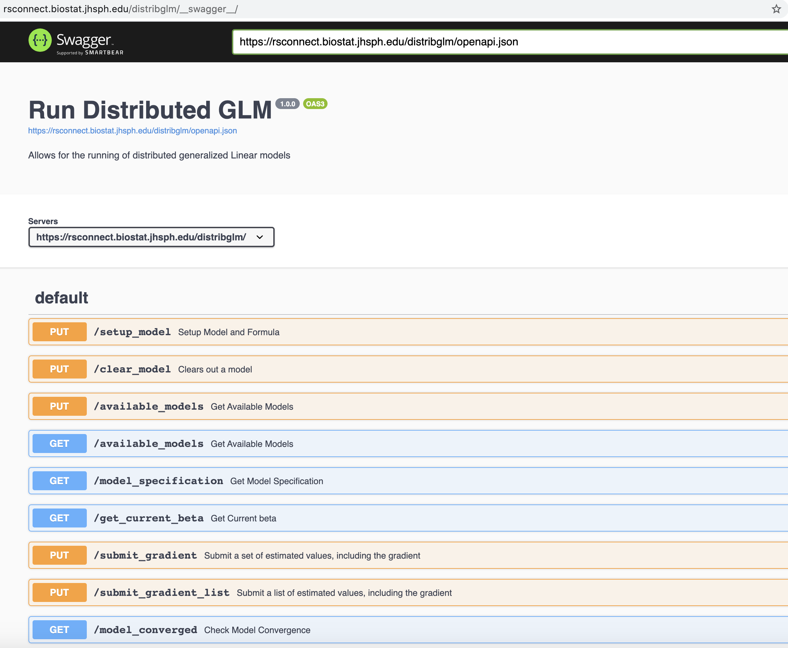

# Introduction

Data from electronic health records (EHRs) provide information on routine clinical care compared to research clinical trials, including the differing data quality and quantity captured.  Unlike clinical trials, which have consent for data sharing and data usage agreements, individual patient-level data from EHRs are less likely to have authorization for sharing by default.  In many cases, however, aggregate data can be shared for research results, reporting, or collaboration with other institutions as these aggregated data cannot be traced back to individuals.  Combining this data from multiple sites allows for analyses that are more statistically powerful, more generalizable, and potentially less-biased due to any one individual site or hospital clinical population demographics.


We introduce a distributed framework and a practical tool to analyze data from multiple sources with the data being properly siloed, sharing only aggregated information.  The motivation for this problem is that we would like to fit a generalized linear model (GLM) on data from multiple sites (e.g. hospitals). The idea is that a model is specified, and instructions or software are sent to each site where a summary statistic is computed and returned to the modeling service/site.  The model is then updated and, if necessary, the process is completed until the model converges.  The goal is to fit the exact model as if the full, aggregated data set was accessible.   We focus on GLMs because they cover a variety of problems and can be fit with low-dimensional aggregated statistics to send to a server, reducing the potential for patient identifiability.  We will discuss how these solutions have been presented before, but we present **practical** tools and software for researchers to achieve these goals without creating these tools from scratch.


The alternatives to this process is meta-analysis, one-step solutions, or remote analysis servers [@o2008remote].  There are drawbacks to a meta-analysis approach in that the model and statistics must be specified and commonly the data is gathered **once** from each site.  Also, if sites present estimates from models with different predictors (e.g. different estimators), it is unclear how meta-analysis adequately handles this variability.  The process below ensures that the same model, with the same predictors, is fit at each site.  Any updated analysis requires additional correspondence between the modeler and the site data analyst, which slows down the process of analysis and creates more hurdles.  

A series of works have covered this topic. The work presented here is almost identical to Grid Binary LOgistic REgression (GLORE) [@glore], its Bayesian analog EXpectation Propagation LOgistic REgRession (EXPLORER) [@explorer], and Secure Pooled Analysis acRoss K-sites (SPARK) [@spark].  A few of the differences are: GLORE and EXPLORER focus primarily on logistic regression, SPARK works for all GLMs like the proposed method.  GLORE and SPARK are iterative requiring all sites to provide updates until the next estimate can be achieved, like the proposed method; EXPLORER is iterative but asynchronous so that sites can share updates without coordination.  SPARK additionally computes on encrypted data, which allows for higher security; EXPLORER uses random matrix implementations to increase security, but required inter-site communication.  Similarly, @wang2017efficient show an iterative method for regularized/sparse model fitting.  @jordan2019communication present a general framework by sending surrogate likelihood information in an iterative way, which generalizes beyond GLMs, and they provide additional examples of M-estimators, regularized/penalized models, and Bayesian models.  Notably, all previous solutions do not provide **practical steps** or tutorials to set up such a system, however.

To alleviate the need for iterative processes, one-shot solutions have been presented.  For example, One-shot Distributed Algorithm to perform Logistic regressions (ODAL) [@duan2019odal] is a distributed estimation procedure for a logistic model. For a given $\beta$ from a model, ODAL computes gradients of a likelihood and use these computed gradients to inform the estimate of $\beta$, but only with one iteration.  @duan2019odal have shown to get close estimates to the "true model", which would be the model fit if all data was included.  The work is expanded upon in Robust-ODAL [@tong2020robust], where median gradients are estimated as opposed to mean gradients, to diminish the influence of heterogeneous site data.  Other methods have shown that efficient one-step estimators or averages perform well compared to an "oracle model" with the full data [@zhang2013communication; @battey2018distributed].

These one-shot methods provide great approximate solutions because 1) they are not iterative, 2) can be computed in a privacy-preserving way, 3) can be robust to outlying data, and 4) can be seen as likelihood updates. As a likelihood update procedure, the same process can be done with all but one site, determining the robustness of the procedure in a sensitivity analysis. The downsides are that the solution is approximate and if another model is to be run, the whole process has to be repeated.  Thus, we believe a remote analysis server can be more general, as it reduces the need for communication with the site and the modeler.

The work presented here is similar to that of @o2009regression as it has a remote analysis server, but with an important difference.  In @o2009regression and most remote analysis servers, a full dataset is aggregated on the remote server so that a full model can be estimated.  That is, the full data is available to that server, but not those submitting the models.  We wish to avoid the full dataset ever being created.  We will perform computations at each site separately, then combining them, also sometimes referred to as federated learning.  Practical implementations of servers for federated learning, such as WebDISCO (web service for distributed Cox model learning) [@lu2015webdisco] exist, but these rely on a third-party service to use.  Many researchers and their institutions may not allow a sharing of data with these services and their own server must be created.  We aim to provide tools to create this server.  (At this time the WebDISCO URL https://webdisco.ucsd-dbmi.org:8443/cox/ was not a working link)

Most recent federated learning methods focus on neural networks.  The most common federated learning architecture is Federated Averaging [@mcmahan2016communication], which uses stochastic gradient descent to combine neural network parameters from multiple devices into one platform. Many platforms have been developed for this type of federated learning, such as the Federated Learning platform from Google for deep learning [@bonawitz2019towards], Content Object Repository Discovery and Registration/Resolution Architecture (CORDA) [@corda], yet implementation details are typically left out, as many health systems have different rules and implementations.  @2017arXiv171207557G and [https://comind.org/](https://comind.org/) provide code on how to set up clients and run a federated deep learning model, but we wish to focus on simpler GLMs in this work, but acknowledge similar inference could be reframed in work based on Tensorflow, a neural network, or their general gradient descent implementations. For more information, @li2019federated provides an good overview of federated learning methods.


One of the main hurdles is that remote analysis servers may be complicated and costly to set up or have little to no instruction on how to set them up, save for the examples with code above.  We will present a system that does have the same constraints, as it will rely on a few scripts or spooling up on a server on a low-cost online service with one command.  


<!-- For almost any approach, the gradient or some reduced-dimensional summary is required to be aggregated together to get the estimate of $\beta$ at the full population level.  If we combine these models with models that require iterative fitting, such as Generalized Linear Models (GLMs), there needs to be a lot of communication and recomputation of summaries to get a final estimate.  These approaches work well in distributed computing systems (such as computing clusters or GPUs), but have a much higher likelihood for errors if human interaction is required at each iteration.  This human interaction is a common practice for most clinical data, which we wish to show a simple solution to create the distributed computing much simpler. -->

We acknowledge we are not experts in distributed/federated computing, but would like to show how this process is possible, overlooking obvious hurdles such as authentication, load balancing, network issues, debugging, and overall security on the server side.  That said, some of the previous methods and authors present solutions with a series of additional checks with privacy-preserving measures which can be implemented.  We argue that analysts already have this responsibility of security, but in a more informal way. In some of the applications above, such as some of the one-shot solutions, the model specification and updates are communicated by easy, likely non-secure methods such as email.  Thus, it would seem as though iterative methods can give exact solutions in a secure way, but the iterative process is burdensome, and one-shot solutions are user-friendly but potentially as insecure as the proposed method.  We wish to make the iterative process more accessible and user-friendly.

A large reason for the importance of usability is that the statisticians and data analysts that will be running the models will likely be using a statistical language, usually either R or Python.  Though we will focus on R, the ideas here can be extended to other languages and systems [@RCORE].  We implemented a practical solution in an R package that allows researchers to practically implement this system with real data.  The solution can be done a number of ways; we implemented 1) code to deploy an API (application programming interface) on a remote server and 2) scripts to calculate the model if using a synced folder, backed by services such as Dropbox, Box Sync, or OneDrive.  These practical solutions solve the motivating problem, allowing us to fit many different types of models with little technical overhead while keeping protected health information (PHI) private.  All code required to set up this platform is open-source and is located in the `distribglm` package: https://github.com/muschellij2/distribglm, with documentation located at https://johnmuschelli.com/distribglm/.  We have an example server as well: [https://rsconnect.biostat.jhsph.edu/distribglm/](https://rsconnect.biostat.jhsph.edu/distribglm/).


# Methods

We will describe generally the example of estimating a GLM, the sufficient statistics needed to fit the model, and how the data is aggregated to fit this model.  For each step, we will note the corresponding function or code that performs these steps.  These technical aspects can be skipped, but are crucial on describing how the statistics and values sent to the server are aggregate and not individual-level.

## Motivating Example

We wish to estimate a GLM an outcome $Y$ on a set of covariates $X$, with a link function $g$.  Let there be $K$ hospitals, and $\mathbf{Y}$ and $\mathbf{X}$ are on the data on all hospitals $1, \dots, K$.  The model is then specified as:

$$
g(E[\mathbf{Y} | \mathbf{X}]) = \mathbf{X}\beta = \eta
$$
where $\eta$ is the linear combination of predictors and coefficients.  Let us also say that we are interested in $p$ covariates, and $n_{k}$ is the total number of records at hospital $k$ and $n = \sum\limits_{1}^{k} n_{k}$, is the number of rows of $\mathbf{Y}$ and $\mathbf{X}$, thus $\mathbf{Y}$ is an $n \times 1$ vector and $\mathbf{X}$ is a $n \times p$ matrix.  Note, $p$ is fixed across sites (all covariates are the same).  To estimate $\beta$, we would use:

$$
(\mathbf{X}'W\mathbf{X})^{-1} \mathbf{X}'W\mathbf{Y}
$$
where $W$ is a matrix of weights determined by $g$.  Since we don't have access to the full $\mathbf{X}$, but rather a series of $X_{k}$, $k = 1, \dots, K$, we could use a number of optimization techniques to find minimums/maximums such as parallelized gradient descent approaches [@zinkevich2010parallelized; @mcdonald2009efficient] or approximate maximum-likelihood approaches [@duncan1980approximate].  We will instead use the Fisher scoring method outlined in @mcculloch2000generalized (page 42), which is commonly used in basic statistical software as it is easily implemented and converges quickly in many cases.  The method is performed such that we get subject-level residuals $u_{i,j,k}$, where $i$ is the subject and $j$ denotes the covariate index for covariate $x_{j}$ where $j = 1\dots p$ and $k$ is again site:

$$
u_{i,j, k} = W (y_{i,k} - \mu) \frac{d\eta}{d\mu}x_{i,j,k}
$$
where we will get $u_{j, k} = \sum_{i} u_{i, j, k}$.  Stacking all the $u_{j,k}$ together will give us the site-aggregated gradient vector $u_{k}$ for all covariates.  Let $V$ be the variance function determined the GLM, evaluated at $\mu$, and $W$ is defined by:

$$
W^{-1} = \left(\frac{d\eta}{d\mu}\right)^2V
$$
which is site-agnostic.  If we let $A_{k} = X_k'WX_k$ we can get $A = \sum_{k}A_{k}$, which is a $p \times p$ matrix.  Combining this with the $u_{k}$ provided by each site, which is a $p\times 1$ vector, then we can calculate $u = \sum_{k} u_{k}$ to get the necessary gradient $\nabla\beta$ by $A^{-1} u$. To estimate the dispersion parameter ($\phi$), we need the sample size for each site $n_{k}$ and the sum of squared residuals, which each are a scalar number.  

Another way of thinking of this process is that in standard GLM fitting, each individual contributes to a residual value to the calculation that is aggregated, usually by the sum.  The same process is being done here, except that individuals are grouped an aggregated respective to their site,  aggregated at the site level, then fully aggregated to give the same estimates as would be given in standard GLM fitting with the full data.

### Summary values shared
Thus, for generalized linear models, we need only to pass a $p\times{p}$ matrix $A$ and $p\times{1}$ vector $u$, and 2 scalar values from each site.   Additional measures such as the deviance and the log likelihood can be shared to estimate commonly-requested values, such as Akaike information criteria (AIC) [@akaike1998information].  It may be possible to determine individual-level covariates or outcomes based on repeated model fitting and estimating the changes in these values, the current implementation requires the site to *actively* send this data for the new model, and the model form can be seen by each site.  Thus, each site would have the ability to not submit data to a model if it believes it would compromise data security.

## Implementation

Thus, one must specify a formula for the model, the exponential family to fit the GLM (e.g. logistic), and a link function, just as you would any GLM.  As the form of the model is the same across sites (i.e. no additional covariates for site 1 vs. site 2) this computation relies on sites having the same data structure.  In this implementation, they must have the same variable names for the covariates.  Without being able to see or clean the full data, each site must ensure this separately.  Fortunately, groups such as the Observational Medical Outcomes Partnership (OMOP) have provided a Common Data Model, which has been adopted by programs such as OHDSI (Observational Health Data Sciences and Informatics) to unify EHR data [@omop; @ohdsi].  These initiatives provide a framework for data unification required for this implementation to work.

To fit this model, we provide the `distribglm` (https://github.com/muschellij2/distribglm) R package to perform the distributed learning models.  The functions provided wherein allow for the fitting of models in addition to 2 specific sets of examples: a `plumber` file and a set of examples files using a "synced folder".  

<!-- The `setup_model` function takes in the formula for the model, the exponential family for the GLM, including the link function.  All relevant functions have an `api_` prefix for the version that  -->

### Synced Folder Implementation
Here we will demonstrate how to fit a model where the sharing of the aggregated statistics is done using a synced folder where all sites would have access to the synced folder. Example synced folders are Dropbox, Box Sync, or Microsoft OneDrive.  This folder will only contain information about the model specifications and the estimates above.  **No PHI would go in this folder**, as it is shared across sites.  

In many cases, one of the sites contributing data will also be the site specifying the model.  We will denote this site the compute site, though this site may does not need to contribute to the model and can be an independent analyst with access to the shared folder. 

The overall process is shown, with the respective functions, in Figure \@ref(fig:workflow).The first step in the process is to set up the model (with the `setup_model` function), which requires the synced folder location (on the local machine), the generalized linear model formula, which exponential family (and link function) is to be fit, a model name, the identifiers for all the sites to use for this model. The site identifiers are necessary for bookkeeping and works as a way to keep track if all necessary sites have computed the aggregated statistics and the next updated $\beta$ estimates can be computed.


![(\#fig:workflow)Illustration of the overall workflow.  An analyst sets up the model using the setup\_model function.  Once that is done, each respective site reads in their data and then runs estimate\_model, which computes gradients and sends them to the folder/server.  Once all gradient values are computed, the coefficients for the next iterations are returned and the gradient is computed again.  This process is repeated until convergence or a fixed number of iterations.  The final model is then located in the synced folder/server, can be downloaded, and the iterations can either be deleted or investigated to ensure convergence and private information has been secure.](workflow.png) 


For example, let's say we have an indicator of death, 3 sites, and want to fit a logistic regression with age and sex as predictors, and we were using Dropbox the code would be:


```r
library(distribglm)
setup_model(model_name = "death_age_sex", 
            formula = "death ~ age + sex", 
            family = binomial(), 
            all_site_names = c("site1", "site2", "site3"),
            synced_folder = "~/Dropbox/shared_folder")
```

Once the model is set up, an output file (an R data file) is synced across all sites and the compute site.  The data sites then run `estimate_model` at the same time and the compute site runs `compute_model`.  

The `estimate_model` function requires the user to specify the the synced folder location, as this local path will vary across sites/computers, the model being fit (as multiple models can be running), the site name, and the data set to be used to estimate the data.  This data set **is not** located in the synced folder.  Each site must have independent code to read in the data into an R `data.frame`.

At each iteration, `estimate_model` submits the summary values specified in section \@ref(summary-values-shared) as an R data file to the synced folder and then waits for the next iteration.  For example, for site 2, the following code could be:


```r
library(distribglm)
site2_data = read.csv("/path/to/mortality_data.csv")
estimate_model(model_name = "death_age_sex", 
               site_name = "site2", 
               data = site2_data,
               synced_folder = "C:/Dropbox/my_shared_folder")
```


The `compute_model` code looks in the synced folder and determines if the all the sites' data has been submitted and the updated estimate can be computed for the next iteration.  Once that is computed, the new estimates are used by the sites in `estimate_model` and the process is repeated until convergence.   A `tolerance` argument exists to control the tolerance required to define convergence, which is equal to $10^{-9}$.


Once the model has converged, the model will be returned and saved.  At that point, all iterations could be deleted or archived.  Again, this procedure requires all site data to be submitted before a new estimate is produced, so ideally all sites model fitting is run at the same time.  We believe a simple conference call walking through each step is a practical example of when this would occur.  We present these estimation and computation steps as separate as most cases have a central analysis site and other contributing sites.  In the `estimate_model` function, if a site sets the argument `run_compute` is set to `TRUE`, then this function will compute the site-level estimates, check to see if all sites have contributed data, and run `compute_model`.  Thus, after running `setup_model`, the only function required for all sites to run is `estimate_model`, which will returned the model when the model converges or hits a maximum number of iterations (default 100).


### Plumber Implementation 

In order to make this process more streamlined, one could create an API.   The R package `plumber` creates APIs with R code [@plumber].  Though there are many frameworks to create APIs, we choose `plumber` as it is the most popular framework for R.  APIs also  require a server.  The `plumberDeploy` package builds on the `plumber` framework for deploying APIs to a server with only a few commands.  RStudio Connect (https://rstudio.com/products/connect/) is also a paid service with the ability to deploy plumber APIs directly from the RStudio software.  As this service may be expensive or require extensive expertise to set up, we will show how to set this up using R functions and a cheap server solution. 

The `plumberDeploy` package uses the `analogsea` package to connect with DigitalOcean (https://www.digitalocean.com/), an easy-to-use cloud deployment service to provide the server [@analogsea].  Many other cloud-based solutions exist, such as Amazon Web Services (AWS), but these deployments are not currently implemented in the `plumberDeploy` package. 


The first step in deploying the API for distributed GLM fitting is to sign up for DigitalOcean.  The services are not free and require a form of payment.  We will create a virtual machine on DigitalOcean, referred to as a "droplet", which we will use as our API server.  You will then need to authenticate your DigitalOcean credentials in R.  The easiest way to do this is to create a token at https://cloud.digitalocean.com/settings/tokens/new, and set it as an environment variable `DO_PAT`.  See the [`analogsea`](https://github.com/sckott/analogsea) package page for more information.  

Next, running `distribglm::do_deploy_glm_api` function will connect to DigitalOcean and create a droplet, and install all the requirements for the API on the droplet, and deploy the API.  If this step is successful, you have a working API!  This function calls the `do_deploy_glm_api_only` function, which deploys the API to the droplet. The `do_deploy_glm_api_only` function will allow you to deploy additional APIs, which may be useful if you want different APIs for different projects.  Multiple APIs can be deployed on a single droplet.  Additional R packages (if required) can be installed via arguments of `do_deploy_glm_api`.  Below, we first create a droplet with `analogsea` and pass this into the deployment function. 


This process may take a few minutes as it is spooling up the server, installing R, a number of system dependencies, and a number of R packages.  The `droplet` object returned contains information about the droplet: 

```r
droplet
```


```
<droplet>TougherAviation (210324177)
  IP:        64.225.124.41
  Status:    active
  Region:    San Francisco 2
  Image:     18.04 (LTS) x64
  Size:      s-1vcpu-1gb
  Volumes:   
```

The most relevant information for our purpose is the public IP address, which we can extract from this object.  


The path to the application depends on the application name, but the default name is "glm" so that the API is located at https://64.225.124.41/glm and the documentation is located at ``https://64.225.124.41/glm/__docs__``.  These links are not active because the droplet is deleted after the model is run and the results are downloaded.  We recommend this as the droplet costs money as long as it is running.  You can delete the droplet with the `droplet_delete` functionality.  If you keep the server running, deleting is not necessary and APIs can be updated by running `do_deploy_glm_api_only`.  To summarize the process, after setting up the credentials for DigitalOcean, running `do_deploy_glm_api` should set up all requirements for the API.


The computational process of the API is similar as above, but the need for a "compute site" is now replaced by the API and the synced folder is replaced by the server.  The additional parameter required is the URL to the API endpoint, which will be given to each site, which we showed above.  This parameter can be set globally in the R environment using the `distribglm_url` environmental variable, or simply running:


```r
api_set_url(url = paste0(ip, "/glm"))
```

during an R session where, `url` is for the `plumber` API.   An analyst then would set up the model as above using `api_setup_model`:


```r
setup_model = api_setup_model(
  model_name = "death_age_sex_api_model", 
  formula = "death ~ age + sex", family = "binomial", 
  link = "logit",
  all_site_names = c("site1", "site2", "site3"), 
  tolerance = 1e-12)
```

One additional feature of using APIs, such as RStudio Connect, would be that you can pass in authorization information to the API with credentials (e.g. an API key) provided to authenticated users:


```r
auth_hdr = httr::add_headers(
  Authorization = paste0("Key ", Sys.getenv("CONNECT_API_KEY")))
setup_model = api_setup_model(..., config = auth_hdr)
```

where `CONNECT_API_KEY` is a environment variable set up on each machine, including data sites and compute sites.  For all `api_*` commands, you can pass this authorization using the `config` argument.  We do not provide a solution to authenticating the users for fitting the models on DigitalOcean.

The model then would make the same folder structure as in the synced folder implementation above.  The sites would then run `api_estimate_model`, which would pass the model name, what site is submitting the data, and the data set (e.g. `mydata`).  Again, the data set is not shared with the API or other sites.  The `api_estimate_model` function calls `api_submit_gradient`, which gets current beta estimates for the model from the API (`api_get_current_beta`), estimates the gradient values for that iteration, then submits a list of the gradient values from the output of `gradient_value`. The `api_estimate_model` function runs this procedure until the model is converged and then returns the output:


```r
site2_data = read.csv("/path/to/mortality_data.csv")
api_estimate_model(model_name =  "death_age_sex_api_model", 
                   site_name = "site2", data = site2_data)
```

This function should be run at the same time other sites are submitting data, otherwise no updates will be done.  If you would like to run this in an asynchronous manner, then running `api_submit_gradient` would be required, or simply letting `api_estimate_model` run and then stopping the command after a few seconds.

We currently have a `plumber` API available at https://rsconnect.biostat.jhsph.edu/distribglm.  A snapshot of the API documentation can be seen in Figure \@ref(fig:docs).  This API endpoint documentation is automatically created when deployed, including the parameters needed for each endpoint.  


 

Thus, given the options of a shared folder or a plumber API, either deployed on DigitalOcean or RStudio Connect, we present a number of options for practical implementations of federated computing for generalized linear models

# Results

We will present examples of fitting GLMs from data and compare the results to the estimated model with the full data set.  First, we create an example data set from random data.  We have 2 predictors and have a fixed beta, but the mean of the first covariate do vary across sites, so the data are not independent of site.  We use $4$ hospital/data sites and a total sample size of $1000$:


```r
generate_data = function(
  n = 1000, n_sites = 4,
  all_site_names = paste0("site", 1:n_sites)) {
  
  probs = runif(n = n_sites)
  probs = probs / sum(probs)
  indices = sample(
    1:n_sites, size = n,
    prob = probs, replace = TRUE)
  
  true_beta = c(0.25, 1.25, -0.3)
  df = data.frame(
    ones = rep(1, n),
    x1 = rnorm(n),
    x2 = rnorm(n, mean = 0, sd = 2)
  )
  df$x1 = df$x1 + rnorm(n, mean = indices)
  expb = exp(as.matrix(df) %*% true_beta )
  df$ones = NULL
  df$prob_y = expb/(1 + expb)
  df$y = rbinom(n, size = 1, prob = df$prob_y)
  df$lambda = drop(expb)
  df$pois_y = rpois(n, lambda = df$lambda)
  df$site = indices

  df
}
df = generate_data()
head(df)
```

```
         x1          x2    prob_y y      lambda pois_y site
1  1.788201 -0.09157237 0.9250290 1  12.3384879     14    3
2  3.132795  0.36388224 0.9829905 1  57.7907887     57    3
3  3.598179 -2.93762750 0.9964207 1 278.3868129    280    4
4 -1.342732 -0.67252557 0.2267669 0   0.2932711      1    1
5  3.410662 -0.23020935 0.9898732 1  97.7477719     84    4
6  1.200794 -0.47624912 0.8691959 1   6.6450192      6    2
```

The `df` object is the full data, and we can estimate the "true" model from the full data set.  Again, this model is the output we are trying to estimate exactly, not approximate:


```r
true_model = glm(y ~ x1 + x2, data = df, family = binomial())
```

In practice, this full data set is never realized, not any site, the API, or the synced folder.  We will split the data by site, and each element of this list represents each site's respective data.  Each site will only have one of these data sets.


```r
datasets = split(df, df$site)
```

We can now set up our model using `api_setup_model`.  Again this would be done by the "compute site" or the analyst.  


```r
model_name = "simple_logistic"
api_setup_model(model_name = model_name, formula = y ~ x1 + x2,
                all_site_names = paste0("site", 1:4), tolerance = 1e-12)
```

```
$formula
[1] "y~x1 + x2"

$family
[1] "binomial"

$link
[1] "logit"

$file
[1] "~/plumber_models/formulas/simple_logistic.rds"

$file_created
[1] TRUE

$model_name
[1] "simple_logistic"

$all_site_names
[1] "site1" "site2" "site3" "site4"

$tolerance
[1] 1e-12
```


As our hosted implementation does not need authorization, adding this header is not needed and will be omitted in the following code.

Now we will run the code as if each site was submitting their estimates.  We run this loop $10$ times as most models converge before 10 iterations.  We extract each independent data set for each site, in the object `data` and pass that to `api_submit_gradient`.  We then get the current beta estimate, which will aggregate the site estimates as all have submitted their data.  The loop will break when the model converges:


```r
for (i in 1:10) {
  for (site_number in 1:4) {
    data = datasets[[as.character(site_number)]]
    site_name = paste0("site", site_number)
    api_submit_gradient(model_name = model_name, verbose = FALSE, 
                        data = data,
                        site_name = site_name)
  }
  beta = api_get_current_beta(model_name = model_name)
  if (beta$converged) {
    break
  }
}
```

In this example, the model converged in $9$ iterations.  In practice, each site would simply run `api_estimate_model`, which wraps both the `api_submit_gradient` and `api_get_current_beta` functionality, but we separate them here as we are running multiple sites worth of data.  The output `eta` contains estimates, of the model, but we should use `api_model_converged` to extract the converged model.  Using `api_model_converged` allows us to get an object similar to the `glm` object in `R`, which the `true_model` for easier comparison.  


```r
model = api_model_converged(model_name)
model
```

```

Call:  glm(formula = y ~ x1 + x2, family = `binomial(link="logit")`)

Coefficients:
(Intercept)           x1           x2  
     0.3782       1.2917      -0.2982  

Degrees of Freedom: 999 Total (i.e. Null);  997 Residual
Null Deviance:	    NA 
Residual Deviance: 341.9 	AIC: 347.9
```

Let's compare that to the full-dataset model:

```r
true_model
```

```

Call:  glm(formula = y ~ x1 + x2, family = binomial(), data = df)

Coefficients:
(Intercept)           x1           x2  
     0.3782       1.2917      -0.2982  

Degrees of Freedom: 999 Total (i.e. Null);  997 Residual
Null Deviance:	    537.8 
Residual Deviance: 341.9 	AIC: 347.9
```
We see the same results for the $\beta$ estimates.  We have not implemented an estimate of the null deviance at this time, but will so in the next iteration of `distribglm`.   We can compare covariance matrices for the estimated, and show that it is the same, up to some precision tolerance:


```r
max(abs(vcov(true_model) - model$covariance))
```

```
[1] 2.228917e-07
```

Note, the tolerance may need to be higher for models small effects or variance, or the model covariates should be scaled so that results are not affected by floating point issues.  We can look at the z-scores and p-values from the model as well:


```r
true_summary = summary(true_model)
true_summary$coefficients
```

```
              Estimate Std. Error   z value     Pr(>|z|)
(Intercept)  0.3782440  0.1989770  1.900943 5.730945e-02
x1           1.2916663  0.1309049  9.867214 5.774599e-23
x2          -0.2981873  0.0752740 -3.961359 7.452439e-05
```

```r
model$z_value
```

```
(Intercept)          x1          x2 
   1.900940    9.867150   -3.961347 
```

which agree up to the 6th decimal point.  

## Model Trace

We can see estimates at each iteration using the `api_model_trace` function and plot the results:


```r
model_trace = api_model_trace(model_name)
```

In Figure \@ref(fig:traceplot), we show the coefficients for each variable over iterations.  The blue line is the estimate from the full-dataset model and we see each estimate converge to the true estimate.  


 

# Discussion 

We have presented an open-source implementation on practically setting up a federated learning system for generalized linear models.  Using already-existing R packages and `distribglm` presented here, we can set up this system with a few commands.  While other implementations exist, they are approximations to the true model, lack implementation details, or are deprecated.  

Though the system may seem simple to describe, many obstacles exist, namely data security.  Mainly opening any system that interacts with patient data or a database (even if it were a spreadsheet) is a potential security risk which most clinical centers will not allow.  Additional security requirements could be enabled, such as random sub-sampling of the data at each site, adding noise to the vectors and matrices passed so that the sum is the same but each individual site has distorted estimates, and other implementations covered in previous work.  

Though this caution is warranted, this system may be more secure than the alternative of sending estimates in other communication systems such as email.  While many of the data security issues exist with shared folders, this security is in line with solutions for shared folders at many institutions.  Though this solution seems like the easiest implementation, we believe the API solution breaks free of synced-folder services such as OneDrive or DropBox.  The API solution does require a server and though we provide an easy solution on DigitalOcean, many institutions choose to use their own systems, which may require an administrator to oversee it.  This administrator is usually trained in information systems or information technology, which is likely not part of the clinical team.  Thus, providing support or interaction from the clinical team to the technical personnel can be more costly than simply emailing estimates.  Lastly, many institutions and research groups require an application of what models are being fit with their data, and thus limits on the API need to be created, which may cause other issues or limitations on the proposed framework.  

These downsides are vastly outweighed when the system gets repeated use.  Thus, fitting one model one time does not generally warrant the work needed to set up this framework.  One specific example is running the same model with different combinations of sites, allowing for a formal sensitivity analysis. The main downside, however, is that as aggregate data is transferred, federated modeling may increase the potential for wrong computation.  For example, checks on the data for missingness, quality, the sample size is equal to that of the previous iteration/model, and other issues, should be implemented for all modeling.  The `distriblm` package can add some of these features, but is not a suite of model checking and diagnostics.  This downside is likely in many of the one-shot solutions and approximations above.  In summary, this framework allows you to *fit* models from multiple sites, but the large caveats of data integrity and quality are still present.  An as an open-source project, researchers can contribute to these checks at https://github.com/muschellij2/distribglm.


References {#references .unnumbered}
==========


<!-- ----------------------------------------- -->
<!-- Don't include -->

<!-- ## Overdispersion  -->
<!-- We estimate output the dispersion parameter in our estimation, we can estimate the variance with dispersion (as the effects are the same): -->

<!-- ```{r quasi} -->
<!-- quasi_model = glm(y ~ x1 + x2, data = df, family = quasibinomial()) -->
<!-- vcov(quasi_model) - model$dispersion * model$covariance -->
<!-- summary(quasi_model) -->
<!-- model$estimated_dispersion -->
<!-- summary(true_model) -->
<!-- ``` -->
